# 🛠 SBEditorTools Usage Guide

This guide explains how to use SBEditorTools to create DataTable assets from `.json` files.  
As an example, we’ll create a DataTable for `CharacterTable`.

Make sure the `SB Tools` menu is visible in the menu bar.  
If you haven't installed SBEditorTools yet, please follow the **[SBEditorTools Installation Guide](install-guide.md)** first.

---

## ✅ Step 1: Open the "SB Tools" Menu

1-1. In the UE4 Editor menu bar, select `SB Tools` → `DataTable` → `CharacterTable`.

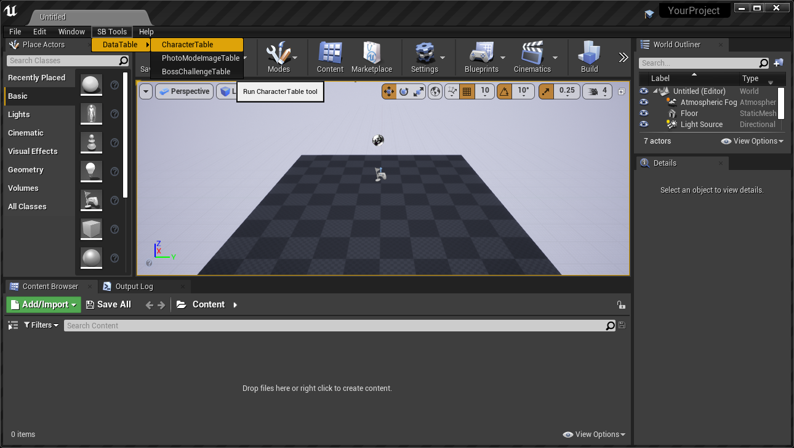

If a DataTable asset already exists in UE4 Editor, a confirmation dialog will appear.  
If you select `Yes`, it will proceed to **Step 2** but will delete the existing DataTable asset. **Be careful!**

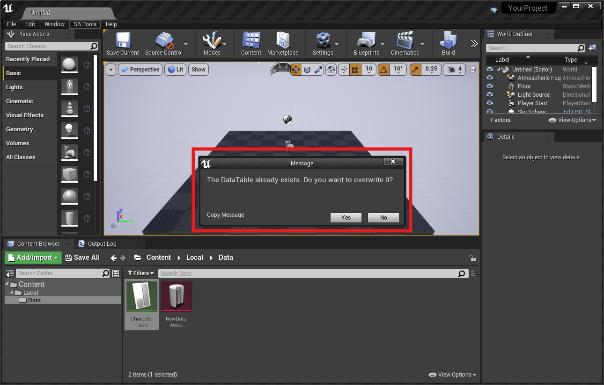

---

## ✅ Step 2: Select a .json File to Create the DataTable Asset

2-1. Select the `.json` file that contains the DataTable data.  

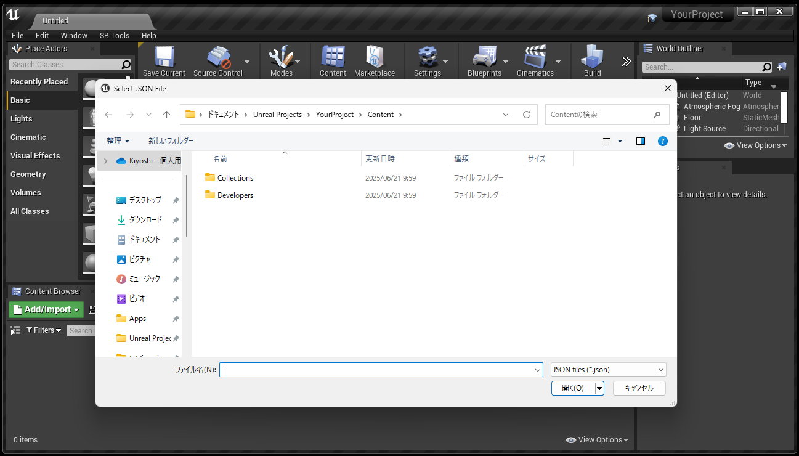  
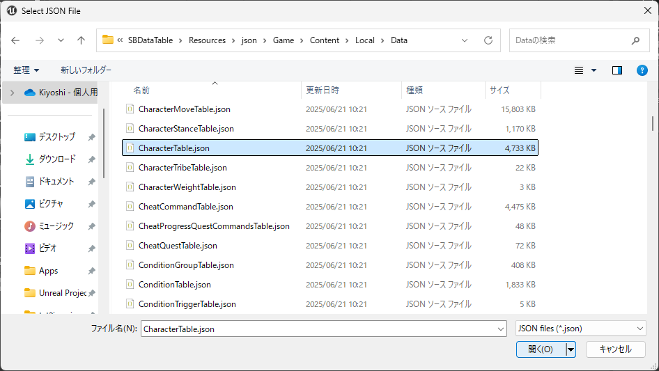

2-2. A DataTable asset will be created in the appropriate folder. If the folder doesn’t exist, it will be created automatically.  
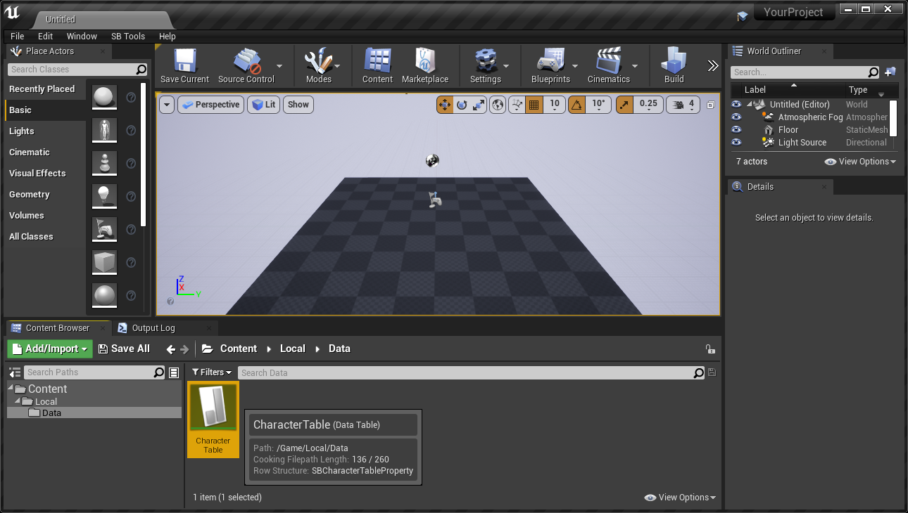

---

### Step 2a: Manually Create the DataTable Asset (optional)

If a definition exists in `SBDataTable`, you can also manually create the DataTable using UE4's built-in method.

2a-1. Right-click in the Content Browser and select `Miscellaneous` → `DataTable`.  
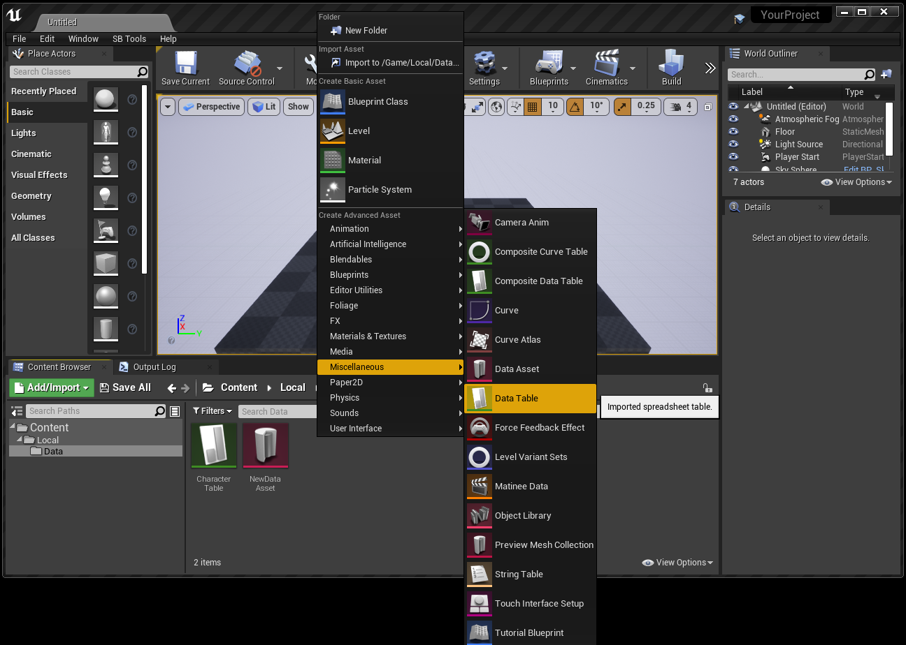

2a-2. In the "Pick Row Structure" dialog, choose the appropriate structure for your DataTable.  
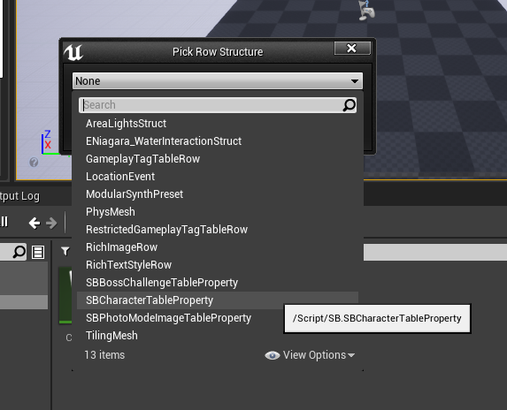

You can find the corresponding Row Structure name at the beginning of the `.json` file.  
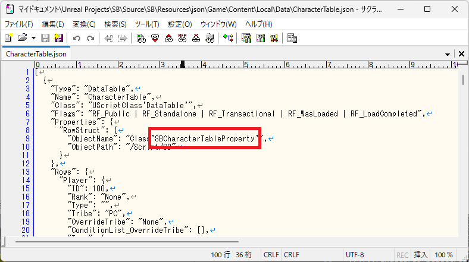

2a-3. Click `Add` to add rows and fill in the values manually.  
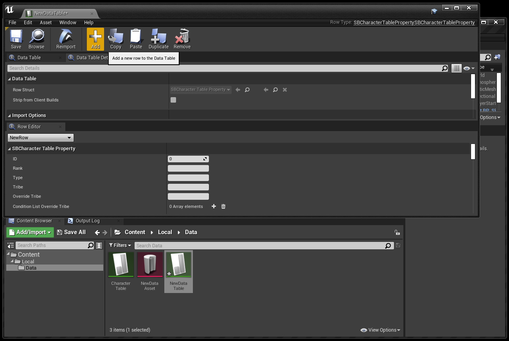

---

## Step 3: Packaging

From this point on, the packaging process follows standard UE4 procedures.

---

### Step 3a: Project Settings

Configure `IOStore` and `Chunk` settings.

3a-1. Go to `Edit` → `Project Settings`, then configure `IOStore` and `Chunk`.  
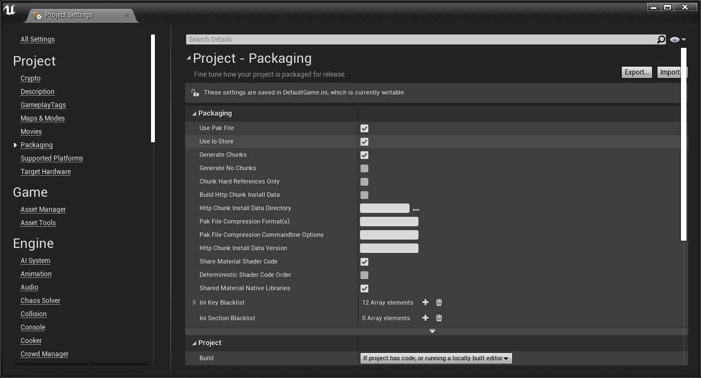

3a-2. Go to `Edit` → `Editor Preferences`, and configure `Chunk` settings.  
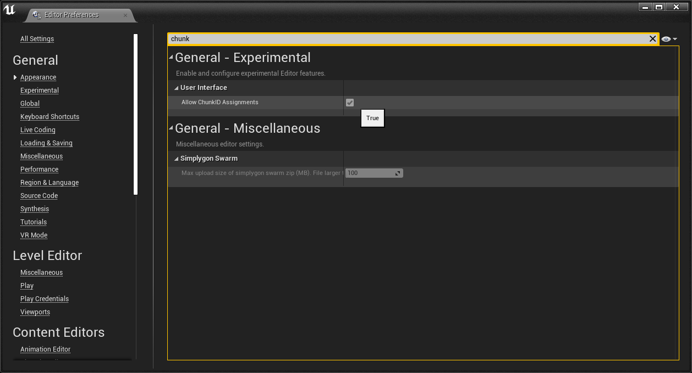

3a-3. In the Content Browser, create a new `DataAsset` under `Miscellaneous`.  
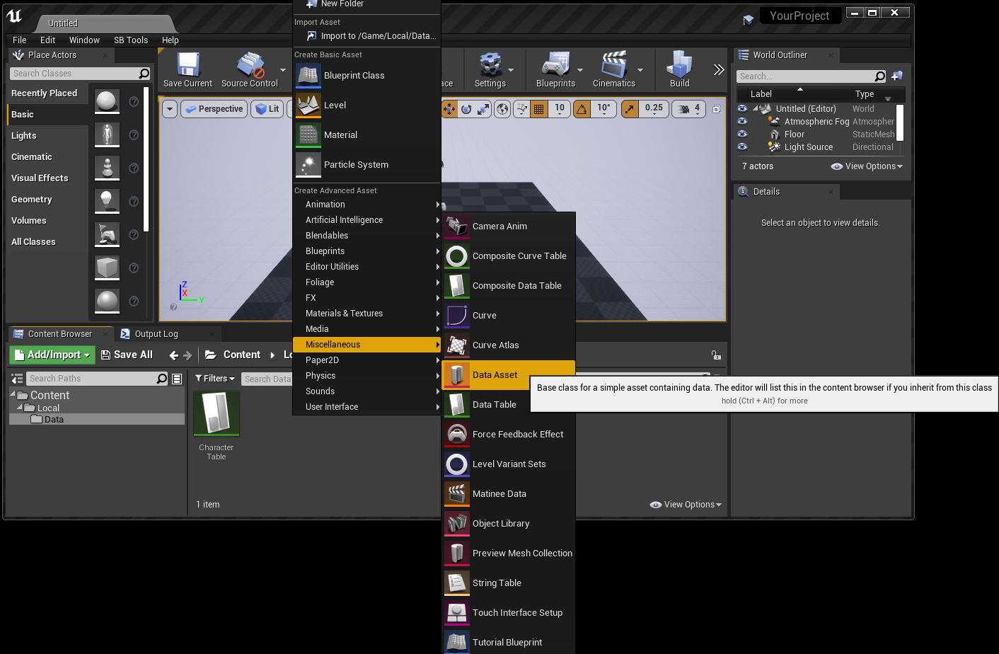

3a-4. Choose `PrimaryAssetLabel`.  
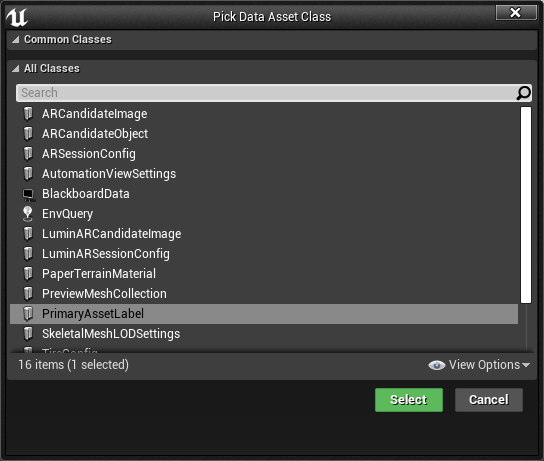

3a-5. The PrimaryAssetLabel will be created. You can name it anything.  
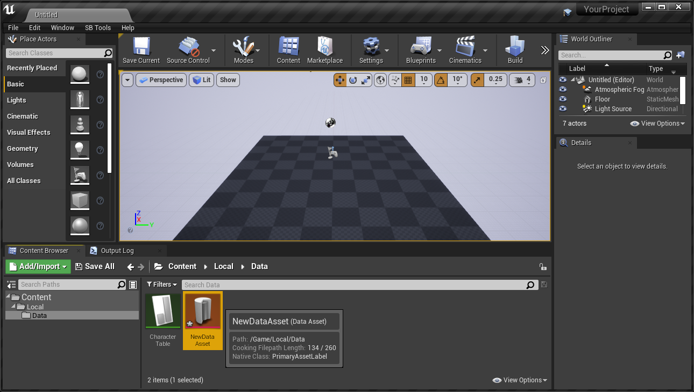

3a-6. Add the DataTable to the PrimaryAssetLabel.  
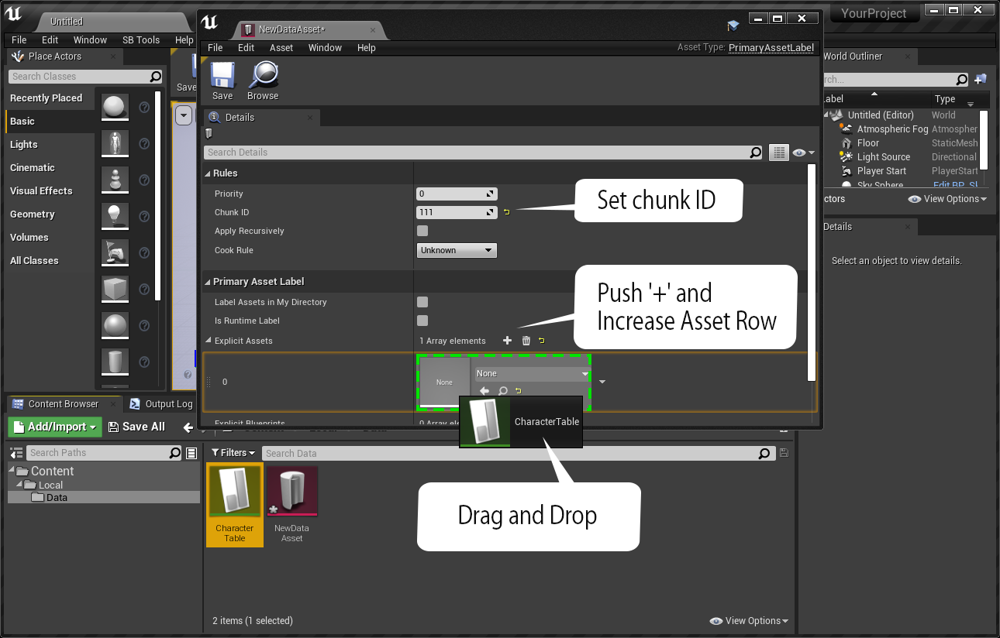

3a-7. Confirm that it has been added successfully.  
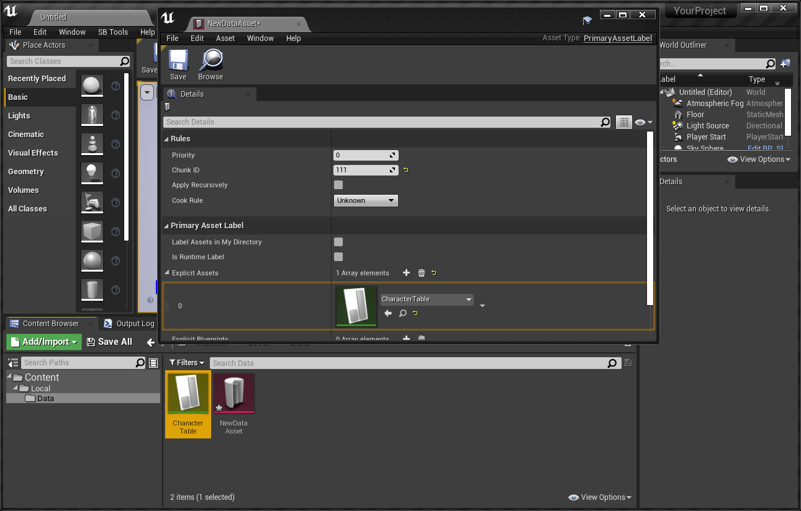

3a-8. From the menu, select `File` → `Package Project` → `Windows (64-bit)` to package.  
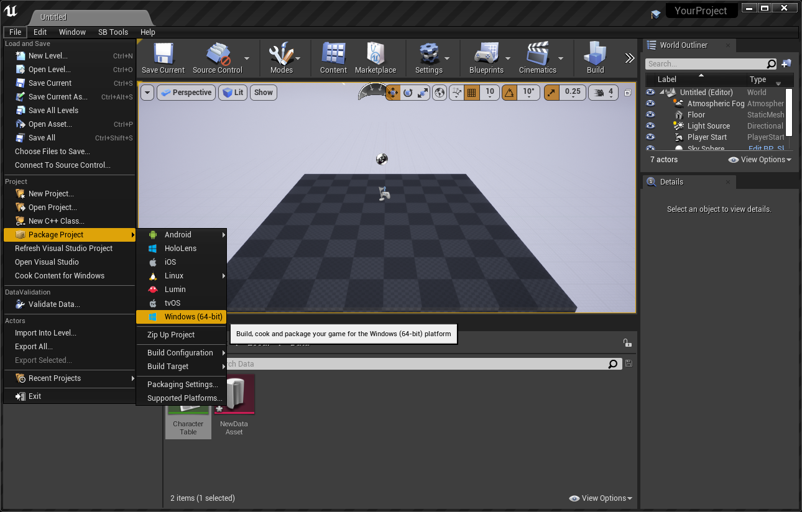

3a-9. Choose the output folder.  

3a-10. If successful, you’ll see a notification like this:  

3a-11. After packaging, the output file will appear.  
To use it as a `MOD`, you must rename the file.  
Conventionally, MOD filenames end with `_P`.  
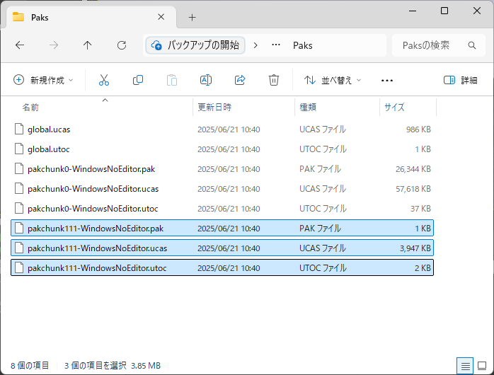
