# 🛠 SBEditorTools の使い方ガイド

このガイドでは、 SBEditorTools を使用して `.json` ファイルから DataTable アセットを作成する方法を説明します。  
ここでは、例として CharacterTable の DataTable を作成します。　　

事前にメニューバーに「SB Tools」のメニューがあることを確認してください。  
まだ SBEditorTools を導入していない場合は **[SBEditorTools インストールガイド](install-guide-ja.md)** を参照して導入してください。

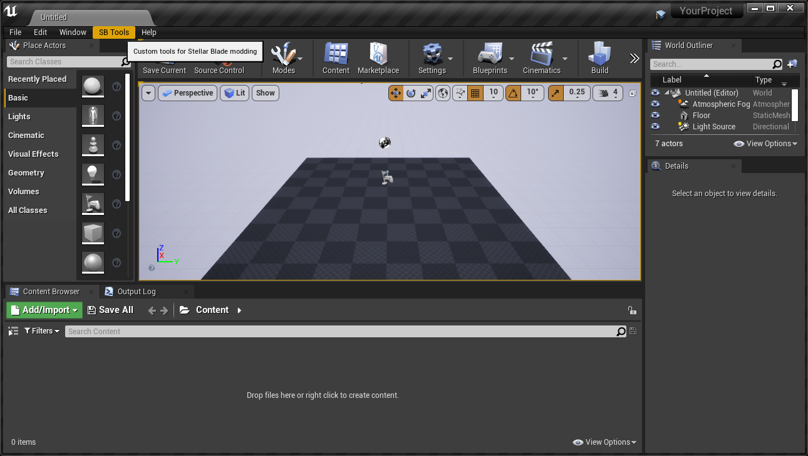

---

## ✅ ステップ1：「SB Tools」メニューを開く

1-1. UE4 Editor メニューバーから `SB Tools` → `DataTable` → `CharacterTable` を選択します。

このとき、既に DataTable アセットが UE4 Editor 上に作成されている場合、上書きしても良いか確認するダイアログが表示されます。  
Yes を選択すると **ステップ2** に進むことができますが、**この時点で既存の DataTable アセットは削除されます。ご注意ください。**  

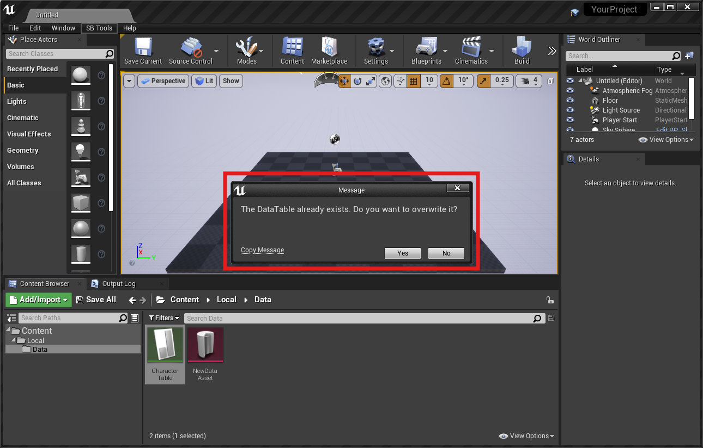

## ✅ ステップ2：.json ファイルを選択して DataTable アセットを作成

2-1. 作成する DataTable の .json ファイルを読み込みます。  

2-2. 選択した DataTable が所定のフォルダに作成されます。フォルダがなかった場合は作成されます。

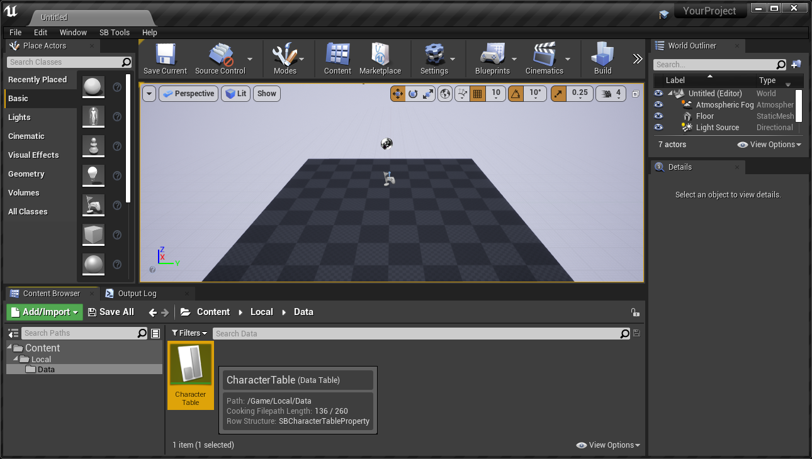

### ステップ2a : .json ファイルからではなく手動でアセットを追加する

`SBDataTable` に定義があれば、UE4 Editor の通常の DataTable 作成手順でもその DataTable を作成することができます。  

2a-1. `Miscellaneous` → `DataTable` を選択します。  

2a-2. `Pick Row Structure` から該当の DataTable 構造体 (Row Structure) を選択します。  

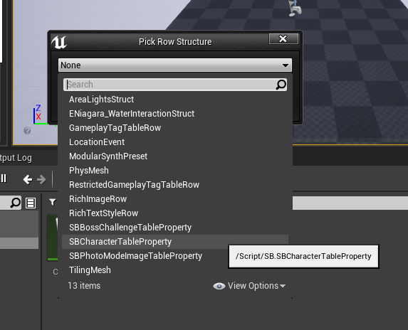

どの Row Structure を選択するかは、元にした .json ファイルの冒頭に記載があります。  

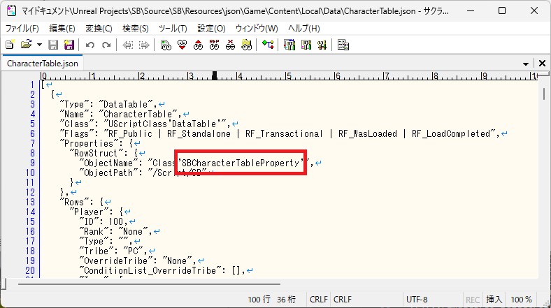

2a-3. `Add` ボタンをクリックして行を追加し、入力していきます。  

## ステップ3 : パッキング

以降は通常のパッキング工程と同じです。

### ステップ3a : プロジェクトの設定

IOStore と Chunk の設定を行います。  

3a-1. メニューバーから `Edit` → `Project Setting...` を選択し、 `IOStore` の設定と `Chunk` の設定を行います。  

3a-2. メニューバーから `Edit` → `Edior Preferences...` を選択し、 `Chunk` の設定を行います。

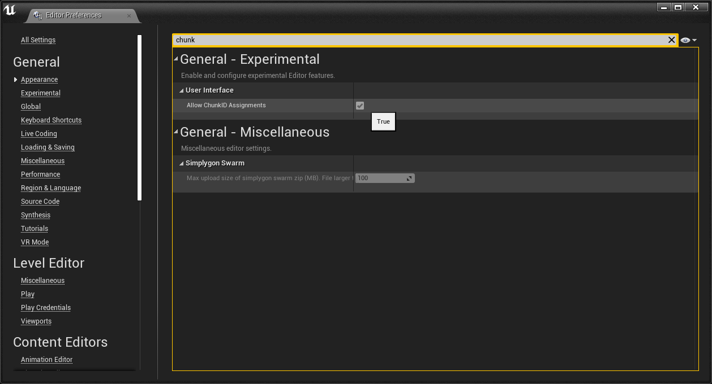

3a-3. `Miscellaneous` → `DataAsset` を選択します。  

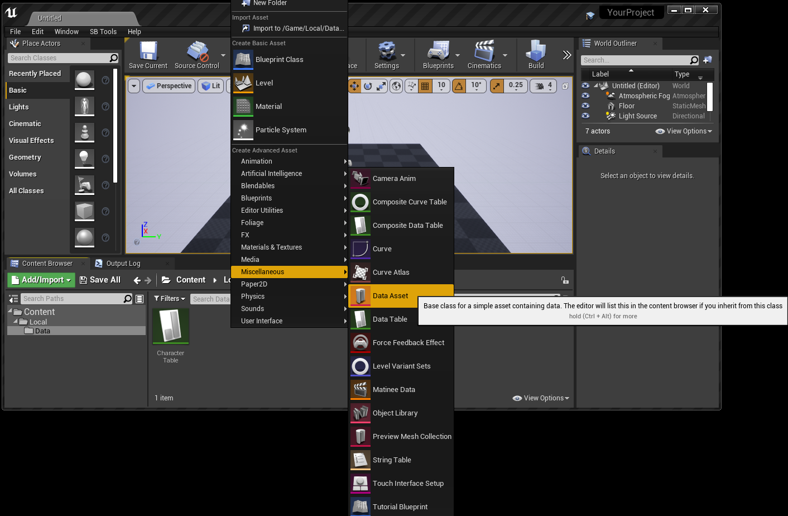

3a-4. `PrimaryAssetLabel` を選択します。

3a-5. PrimaryAssetLabel が作成されます。名前は何でも良いです。  

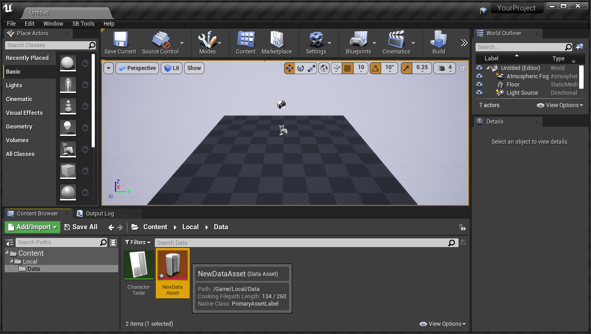

3a-6. PrimaryAssetLabel に DataTable を追加します。  

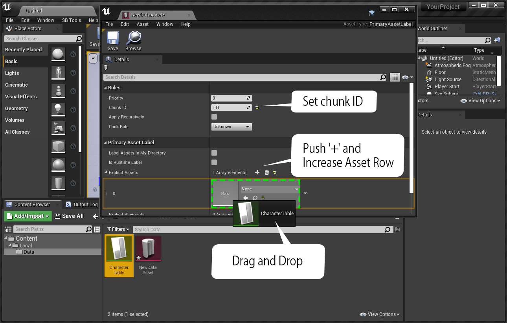

3a-7. 追加されたことを確認します。  

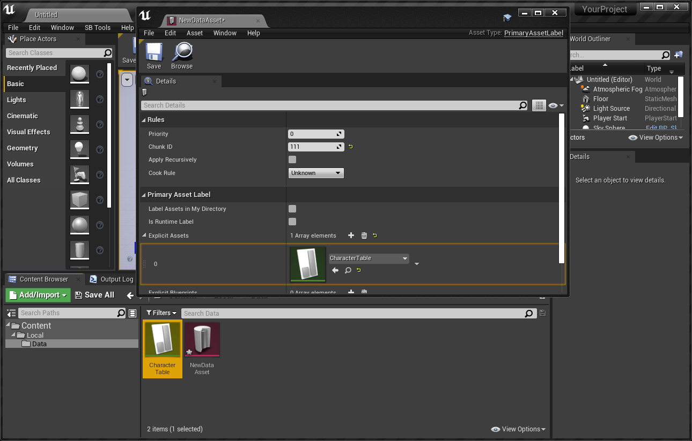

3a-7. メニューバーから `File` → `Package Project` → `Windows (64-bit)` を選択してパッケージングを実行します。  

3a-8. 結果を出力するフォルダーを選択します。    

3a-9. 成功した場合はこのようなメッセージが画面右下に表示されます。  

3a-10. パッケージングが成功するとファイルが作成されます。 `MOD` として有効にするためにはファイル名を変更する必要があります。  
また、 `MOD` のファイル名の末尾には `_P` をつけるのが慣例となっています。  

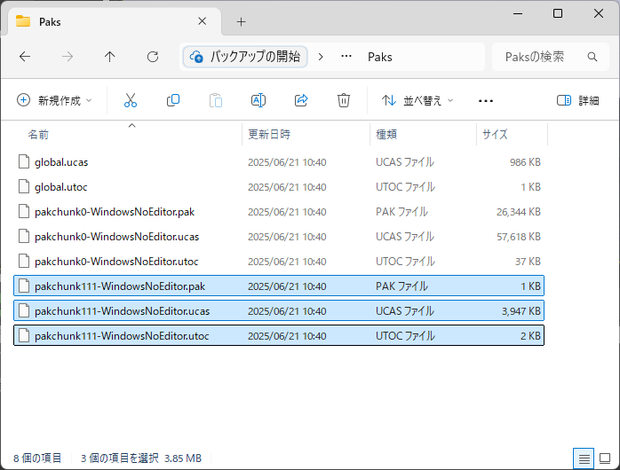
