# 📥 SBEditorTools インストールガイド

このガイドでは、SBDataTable を UE4 プロジェクトに導入する手順を、スクリーンショット付きで解説します。

---

## Step 1 : UE4 プロジェクトの作成　(新規に作成する場合)

Unreal Engine 4.26 で任意の名前でプロジェクトを作成します。 `Blueprint` でも `C++` でも大丈夫です。  
既存のプロジェクトに導入するには **Step 2** から実行してください。

1-1. `Games` → `Next` を選択します。  


1-2. `Blank` → `Next` を選択します。  
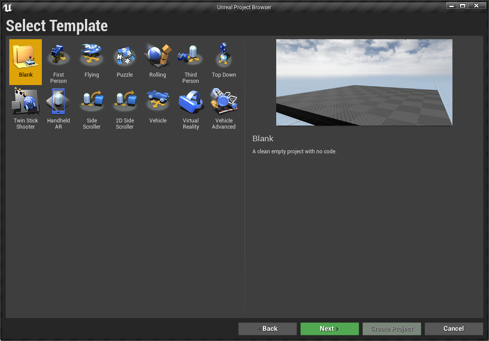

1-3. `Blueprint` か `C++` かどちらでも良いですが、 `Blueprint` を選択した場合は Step 2 で C++ 化する手順が必要になります。そのまま `Create Project` を選択します。  
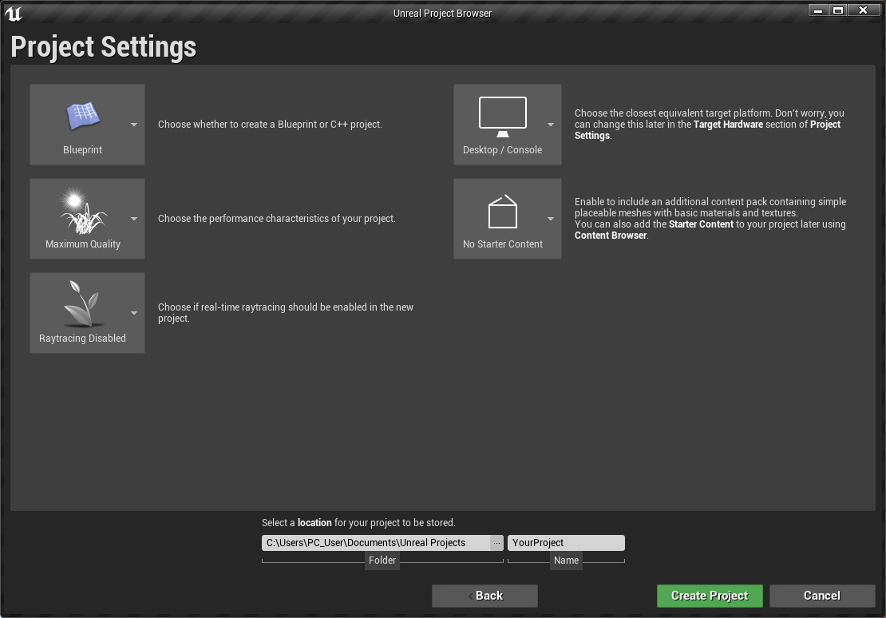

## Step 2 : C++プロジェクト化

プロジェクトを`C++`プロジェクト化します。Step 1 で `C++` を選択した場合、もしくは既存プロジェクトが既に `C++` の場合は **Step 3** に進んでください。  
**Step 1** で `Blueprint` を選択した場合や既存のプロジェクトが `Blueprint` の場合、もしくはどちらかわからない場合はこのまま **Step 2** を実施してください。

2-1. `File` → `New C++ Class...` をクリックします。  

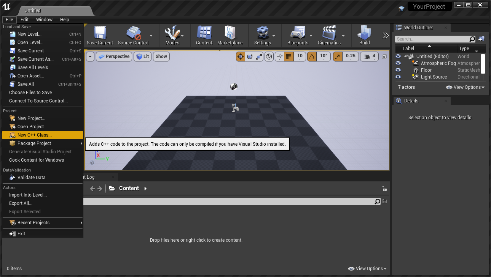

2-2. `Choose Parent Class` ダイアログが開くので `None` → `Next` を選択します。  

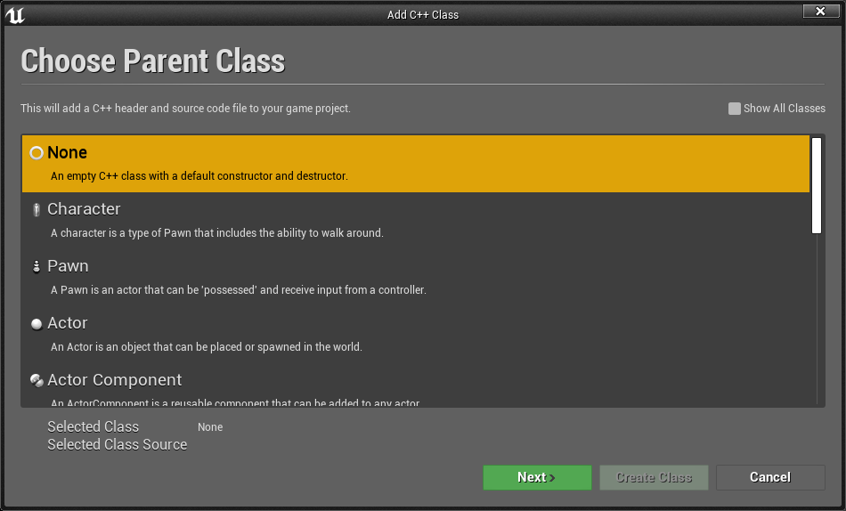

2-3. `Name` に適当な名前を入れて `Create Class` を選択します。  

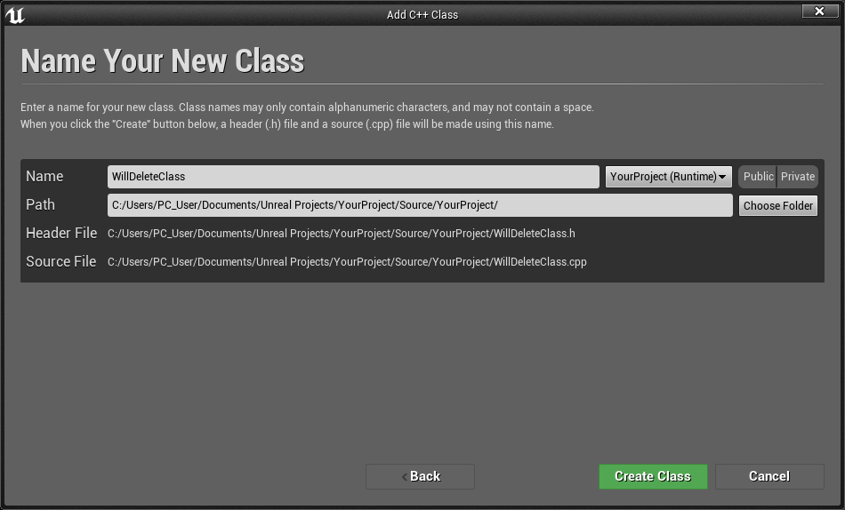

2-4. コンパイルが走るので待ちます。  

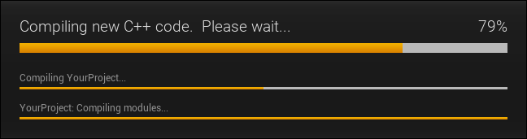


2-5. コンパイルが完了すると Visual Studio が開きます。  
この時点でプロジェクトが C++化されています。このまま **Step 3** に進んでも構いませんが、一応今作成した不要なクラスをプロジェクトから除外しておきます。  

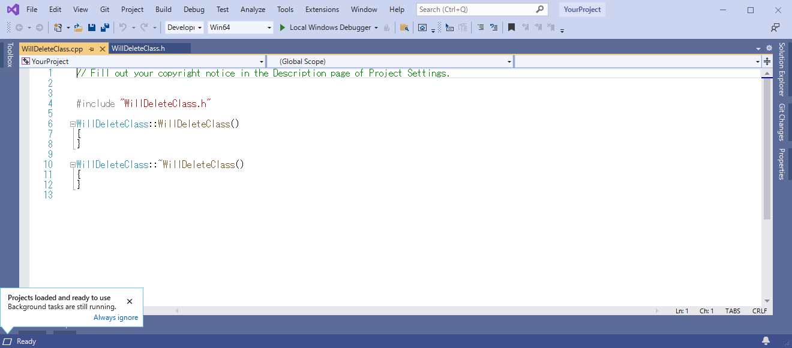

2-6. Sourse フォルダの下の `2-3.` で入力したクラス名のフォルダごとソリューションから除去します。  

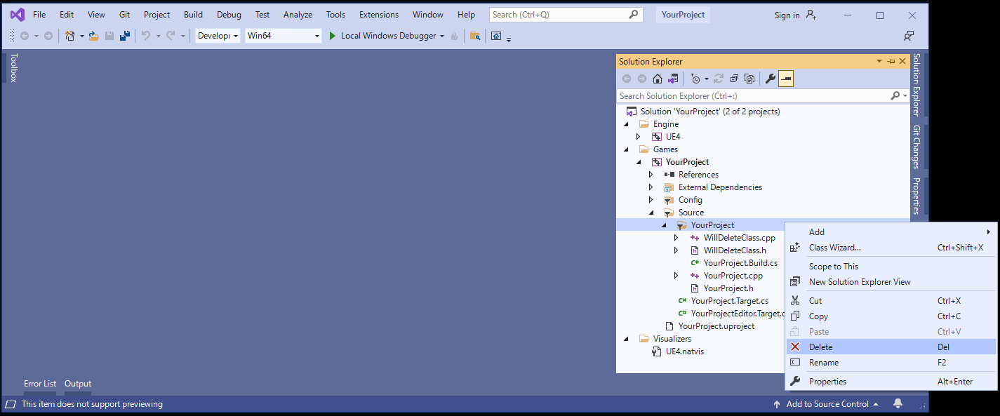

2-7. `OK` をクリックします。  

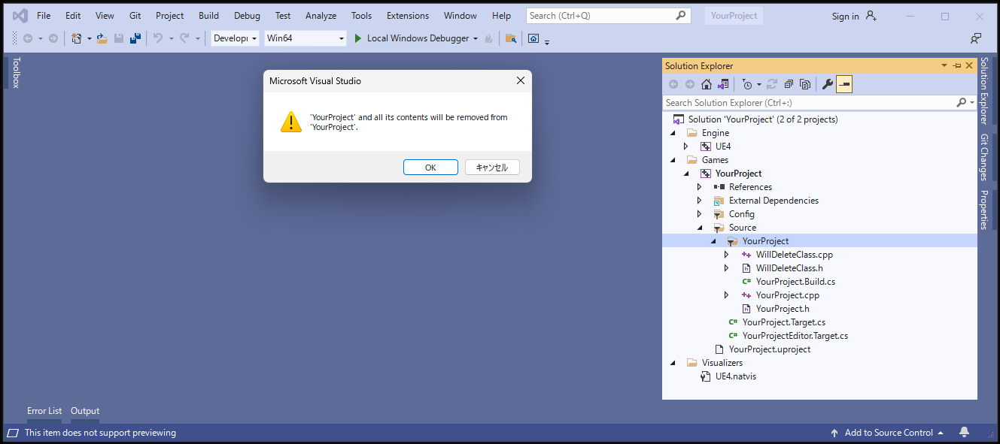

2-8. ソリューションから不要なクラスが削除されました。実際にはフォルダおよび `.h` / `.cpp` ファイルは残っていますが問題ありません。  

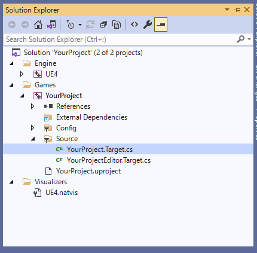

2-9. Visual Studio を閉じます。

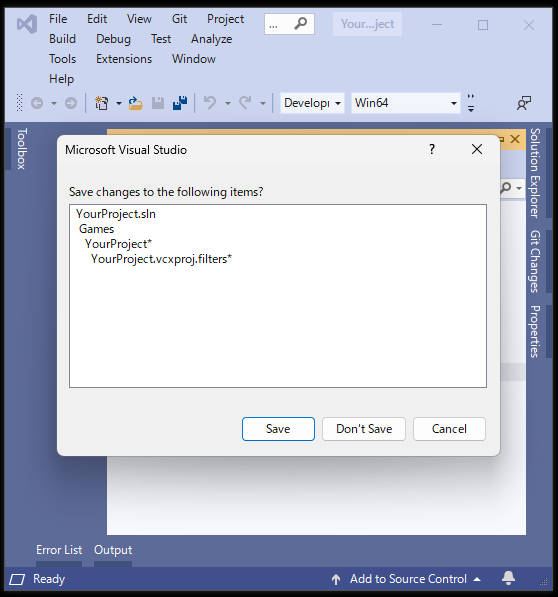

## Step 3 : SBDataTable および SBEditorTools の導入

プロジェクトに [SBDataTable](https://github.com/Kiyopon46/SBDataTable/) および [SBEditorTools](https://github.com/Kiyopon46/SBEditorTools/) の2つのリポジトリを組み込みます。

3-1. この時点でプロジェクトは次のようなフォルダ構成になっていると思います。既にプラグインを導入済みの場合は `Plugins` のフォルダがあると思います。  
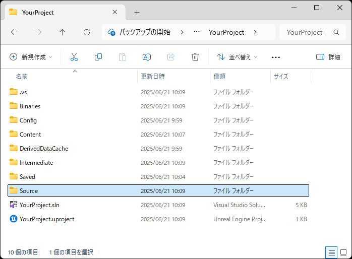

3-2. `Source` フォルダの下に `SBDataTable` を `Github` からクローンします。 [SBDataTable/releases](https://github.com/Kiyopon46/SBDataTable/releases) から最新バージョンの `ZIP` ファイルをダウンロードして展開しても良いです。  

```
git clone https://github.com/Kiyopon46/SBDataTable.git
```

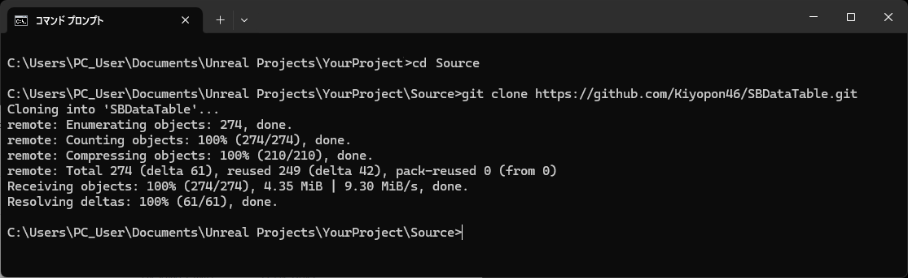

3-3. `Plugins` フォルダの下に `SBEditorTools` を `Github` からクローンします。 [SBEditorTools/releases](https://github.com/Kiyopon46/SBEditorTools/releases) から最新バージョンの `ZIP` ファイルをダウンロードして展開しても良いです。  

```
git clone https://github.com/Kiyopon46/SBEditorTools.git
```

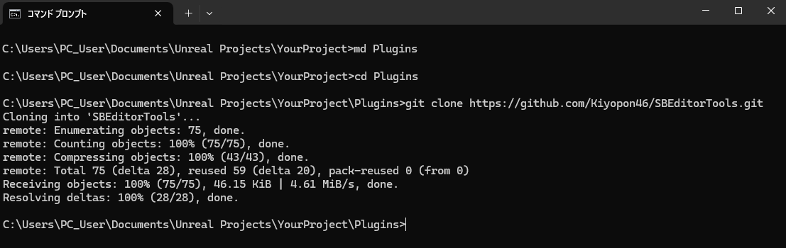

3-4. ここまででフォルダ構成は以下のようになります：  

```
/YourProjectName/
├── Plugins/
│ └── SBEditorTools/
└── Source/
  └── SBDataTable/
```

3-5. UE4 Editor が起動中であれば一度終了し、再起動してください。

3-6. UE4 Editor を起動すると SBEditorPlugin のビルドを求められるのでビルドしてください。  
.uproject ファイルから直接 UE4 Editor を起動できます。  

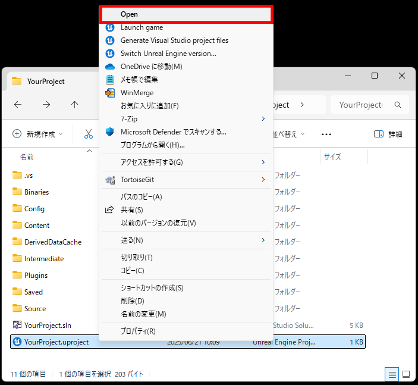

3-7. 起動時に SBEditorTools プラグインのビルドを求められるので「Yes」を選択します。  

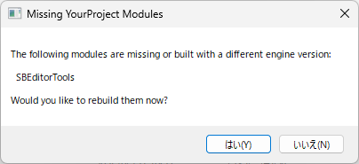

3-8. プラグインのビルドが実行されます。  

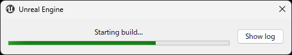

3-9. 無事に UE4 Editor が起動できればOKです。  

## Step 4 : SBEditorTools Plugin の有効化

4-1. UE4 Editor のメニューから「Edit → Plugins」を開き、「SB」と検索し、`SBEditorTools` を有効化します。  

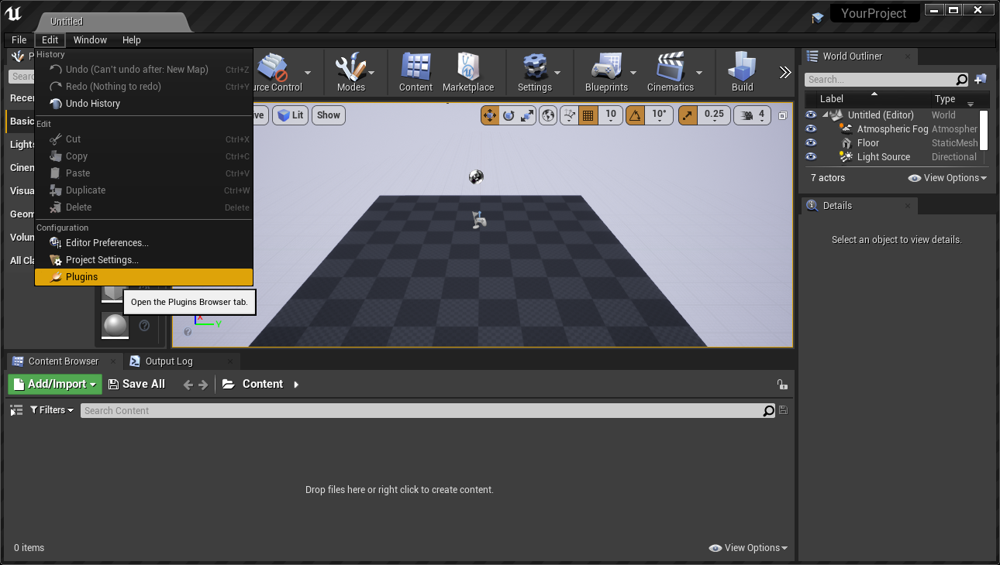

4-2. プラグイン選択の画面で「SB」と検索し、`SBEditorTools` を有効化します。プラグインの有効化後に再起動を求められるので、再起動します。  

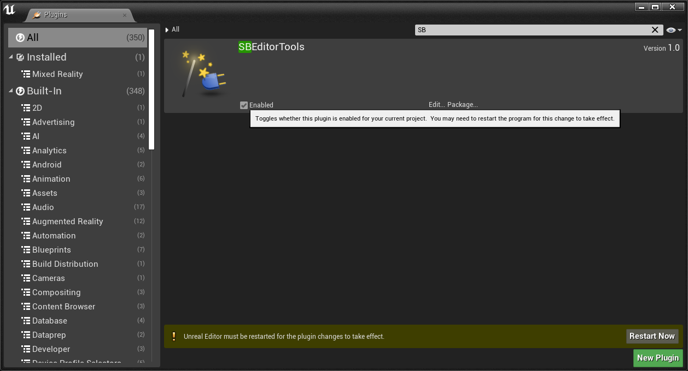


4-3. UE4 Editor 起動後、メニューバーに「SB Tools」が追加されていれば準備完了です。  

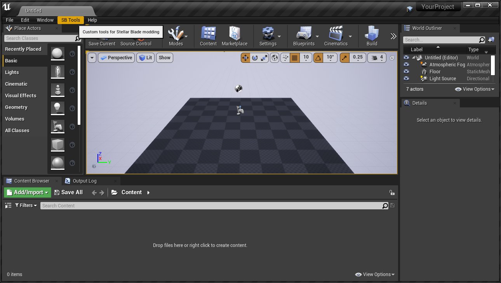
